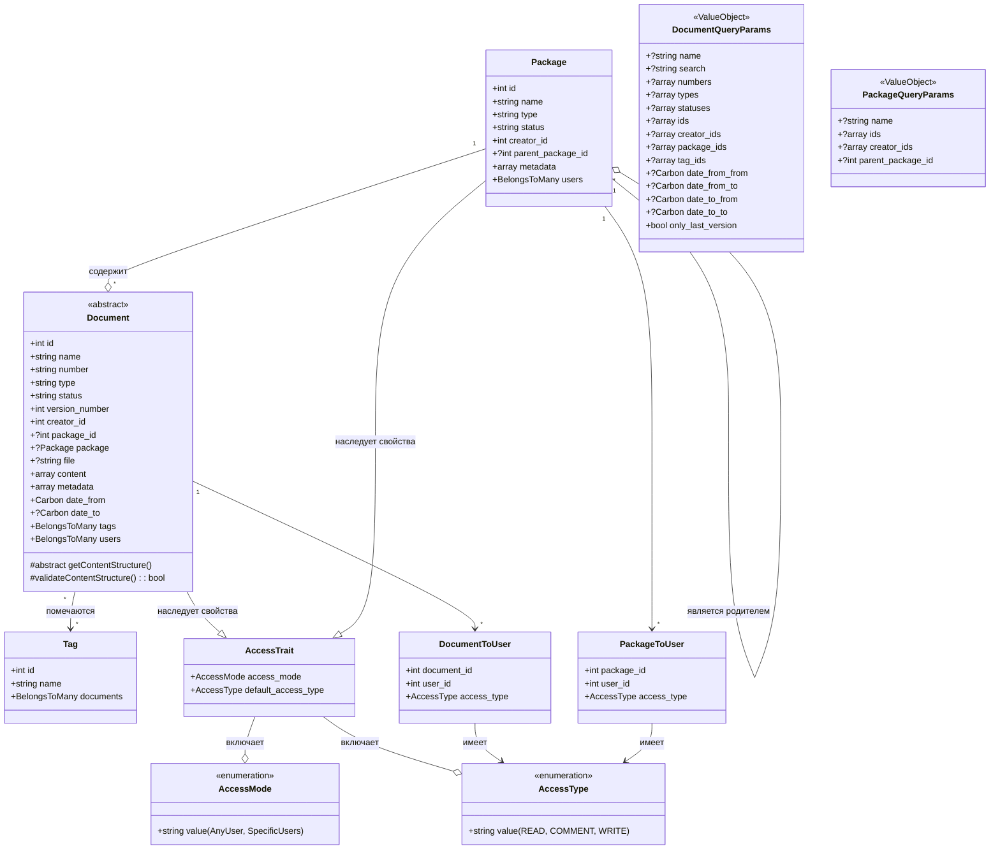

# Документация по Data Model модуля "Документы" (Documents)

## Введение

Эта документация описывает структуру данных для модуля "Документы". Модуль обеспечивает создание, хранение, управление и
отслеживание жизненного цикла различных типов документов в системе. Он поддерживает версионирование, тегирование,
управление доступом и интеграцию с другими модулями.

## Схема:

## Сущности

### Документ (Document)

Абстрактный класс. Основная сущность, представляющая документ в системе. Включает:

- `id`: Уникальный идентификатор документа.
- `name`: Название документа.
- `number`: Уникальный номер документа.
- `type`: Тип документа.
- `status`: Статус документа.
- `version_number`: Номер версии документа.
- `creator_id`: Идентификатор создателя документа.
- `package_id`: Идентификатор пакета, к которому относится документ (необязательное поле).
- `Package`: Связь с пакетом документов.
- `file`: Путь к файлу (необязательное поле).
- `content`: Произвольный контент в формате JSONB.
- `metadata`: Метаданные в формате JSONB.
- `date_from`: Дата начала действия документа.
- `date_to`: Дата окончания действия документа (необязательное поле).
- `tags`: Связь с тегами (многие ко многим).
- `users`: Связь с пользователями (многие ко многим).

### Пакет (Package)

Группа документов, объединенная по определенным признакам. Содержит:

- `id`: Уникальный идентификатор пакета.
- `name`: Название пакета.
- `type`: Тип пакета документов.
- `status`: Статус пакета.
- `creator_id`: Идентификатор создателя пакета.
- `parent_package_id`: Идентификатор родительского пакета (необязательное поле).
- `metadata`: Метаданные пакета в формате JSONB.

### Тег (Tag)

Используется для классификации документов. Содержит:

- `id`: Уникальный идентификатор тега.
- `name`: Название тега.

### Доступ (AccessTrait)

Описывает модель доступа к документам. Может быть:

- `access_mode`: Режим доступа (для конкретных пользователей или для всех).
- `default_access_type`: Тип доступа по умолчанию (чтение или запись).

### Связи между документами и пользователями (Document_to_User, Package_to_User)

Описывают права доступа пользователей к документам. Содержат:

- `document_id`: Идентификатор документа.
- `user_id`: Идентификатор пользователя.
- `access_type`: Тип доступа (чтение, комментирование или запись).

### Связи между пакетами и пользователями (Package_to_User)

Описывают права доступа пользователей к документам. Содержат:

- `package_id`: Идентификатор документа.
- `user_id`: Идентификатор пользователя.
- `access_type`: Тип доступа (чтение, комментирование или запись).

### Перечисления (AccessMode, AccessType)

Описывают возможные значения для режима доступа и типа доступа.

## Объекты-значения

### DocumentQueryParams

Этот объект-значение используется для инкапсуляции параметров запроса при поиске документов. Он обеспечивает строгую
валидацию входящих данных, чтобы гарантировать корректность запросов к базе данных.

#### Структура

- `name`: Название документа (опционально).
- `search`: Строка для поиска по содержимому документа (опционально).
- `numbers`: Массив номеров документов (опционально).
- `types`: Массив типов документов (опционально).
- `statuses`: Массив статусов документов (опционально).
- `ids`: Массив идентификаторов документов (опционально).
- `creator_ids`: Массив идентификаторов создателей (опционально).
- `package_ids`: Массив идентификаторов пакетов (опционально).
- `tag_ids`: Массив идентификаторов тегов (опционально).
- `date_from_from`: Начальная граница даты действия документа (опционально).
- `date_from_to`: Конечная граница даты начала действия документа (опционально).
- `date_to_from`: Начальная граница даты окончания действия документа (опционально).
- `date_to_to`: Конечная граница даты окончания действия документа (опционально).
- `only_last_version`: Флаг для настройки запроса для получения только последних версий документов (опционально).

#### Валидация

Для обеспечения корректности и целостности данных, `DocumentQueryParams` включает следующие проверки:

- **Дата**: Проверяется, что значения дат `date_from_from`, `date_from_to`, `date_to_from`, и `date_to_to` соответствуют
  корректному формату и логически правильно распределены (например, начальная дата не позже конечной).
- **Идентификаторы**: Все идентификаторы в массивах `ids`, `creator_ids`, `package_ids`, и `tag_ids` должны быть
  натуральными числами.
- **Строки**: Строковые параметры, такие как `name` и `search`, проверяются на соответствие допустимым форматам и длине.

Эти проверки помогают избежать ошибок при формировании запросов к базе данных и улучшают безопасность и надежность
работы системы.

### PackageQueryParams

Этот объект-значение используется для инкапсуляции параметров запроса при поиске пакетов документов. Он позволяет точно
и безопасно фильтровать пакеты по заданным критериям.

#### Структура

- `ids`: Массив идентификаторов пакетов (опционально).
- `name`: Название пакета (опционально).
- `types`: Тип пакета (опционально).
- `statuses`: Статус пакета (опционально).
- `creator_ids`: Массив идентификаторов создателей пакетов (опционально).
- `parent_package_id`: Идентификатор родительского пакета (опционально).

#### Валидация

Для поддержания целостности данных и предотвращения ошибок в запросах, `PackageQueryParams` включает следующие проверки:

- **Идентификаторы**: Проверяется, что все идентификаторы в массивах `ids`, `creator_ids`, а также `parent_package_id`
  являются натуральными числами.
- **Строки**: Параметр `name` проверяется на соответствие допустимому формату строки и длине, чтобы избежать ввода
  некорректных данных.
