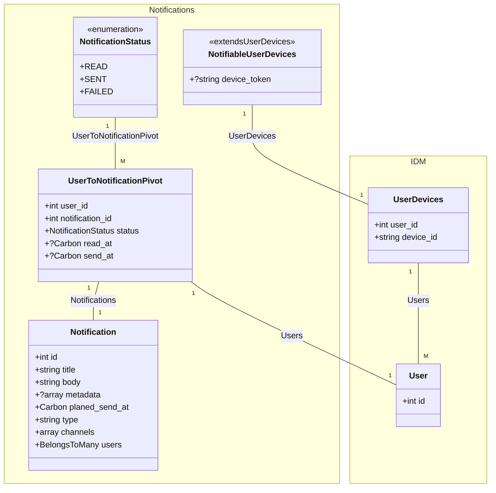

# Notification Module

## Введение

Модуль **Notification** предоставляет возможность отправки уведомлений пользователям через различные каналы (например,
email, push-уведомления).

## Схема:

## Сущности

### Notification Module
---

#### Notification (Уведомления)

**Описание**: Сущность **Notification** используется для хранения и управления уведомлениями.

##### Поля:

- `id`: Идентификатор уведомления.
- `title`: Заголовок уведомления.
- `body`: Текст уведомления.
- `metadata`: Дополнительные данные уведомления.
- `planed_send_at`: Дата и время запланированной отправки уведомления.
- `notification_type`: Тип уведомления.
- `channels`: Каналы отправки уведомления.
- `users`: Пользователи, которым отправляется уведомление.

##### Связи:

- **Users**: Уведомление связано с пользователями через отношение "многие ко многим" (BelongsToMany).

---

#### UserToNotificationPivot (Связь уведомлений с пользователями)

**Описание**: Промежуточная сущность для связи уведомлений с пользователями.

##### Поля:

- `user_id`: Идентификатор пользователя.
- `notification_id`: Идентификатор уведомления.
- `status`: Статус уведомления.
- `read_at`: Дата и время прочтения уведомления.
- `send_at`: Дата и время отправки уведомления.

---

#### NotificationStatus (Статус уведомления)

**Описание**: Перечисление **NotificationStatus** используется для хранения статуса уведомления.

##### Поля:

- `READ`: Уведомление прочитано.
- `SENT`: Уведомление отправлено.
- `FAILED`: Ошибка отправки уведомления.

---

#### Channel (Каналы отправки уведомлений)

**Описание**: Перечисление **Channel** используется для хранения списка каналов отправки уведомлений.

##### Поля:

- `EMAIL`: Отправка уведомления по электронной почте.
- `PUSH`: Отправка уведомления через push-уведомления.
- `SMS`: Отправка уведомления через SMS.
- `WHATSAPP`: Отправка уведомления через WhatsApp.
- `TELEGRAM`: Отправка уведомления через Telegram.

---

#### NotifiableUserDevices (Устройства для отправки уведомлений)

**Описание**: Сущность **NotifiableUserDevices** используется для хранения информации об устройствах, на которые можно отправлять уведомления.

##### Поля:

- extends `UserDevices`
- `device_token`: Токен устройства.

---

### IDM Module

##### UserDevices (IDM Module)

**Описание**: Сущность **UserDevices** используется для хранения информации о привязанных к пользователю устройствах.

### Поля:

- `user_id`: Идентификатор пользователя.
- `device_id`: Идентификатор устройства.

---
